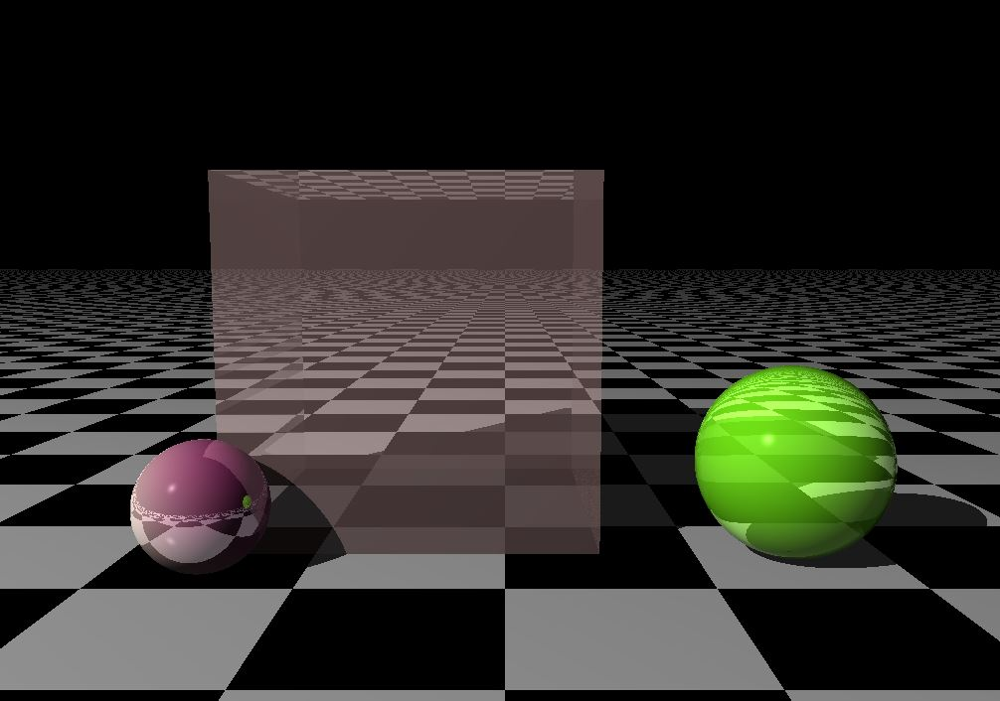

CPU raytracer build with C++. 

It renders objects with basic gometries which can have a flat color or a pattern.
It includes shadows, reflections and refractions. 

Since it runs in the CPU and not in the GPU it takes way too long to render a single frame :-)

Current result:
